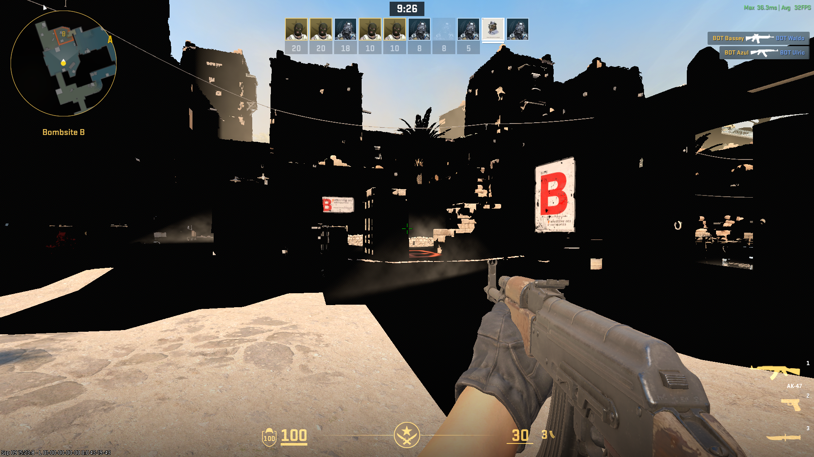
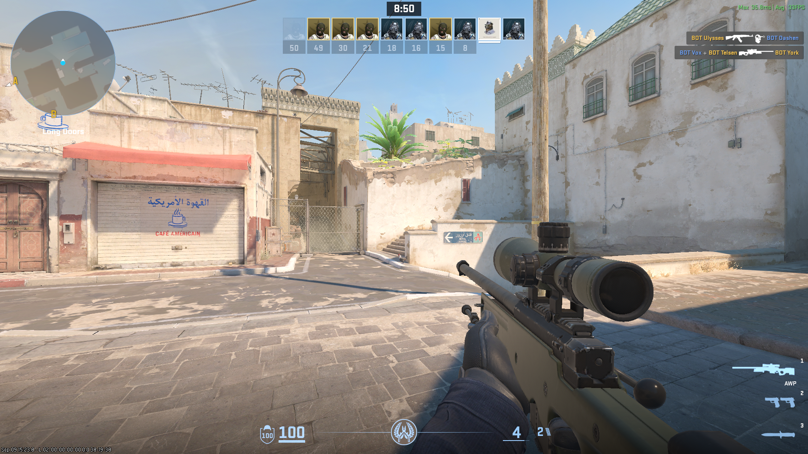

# Turnip non-zero-base-mip minimum-LOD fix

This repository contains a small Mesa/Turnip patch, a standalone Vulkan
reproducer, and the evidence that connects the driver defect to corrupted
rendering in Counter-Strike 2 on an Adreno 690.

The bug is in the A6xx/A7xx texture-view descriptor path. When an image view
has a non-zero `baseMipLevel` and no explicit minimum LOD, Mesa can pass a
negative value to the unsigned `MIN_LOD_CLAMP` field packer. The resulting
floating-to-unsigned conversion is undefined. In the tested x86 build,
`-4.0` became `0xc00` (LOD 12), causing valid reads through a rebased view to
return zero.

The proposed change clamps the view-relative minimum LOD to zero before it is
packed. It fixes the standalone reproducer and live CS2 rendering on the
Windows Dev Kit 2023. Reverting only the change restores the failure.

## Repository contents

- [`patches/`](patches/) contains the minimal Mesa source change.
- [`build/`](build/) contains the tested i686 Meson cross-file and build
  procedure.
- [`reproducer/`](reproducer/) contains the headless Vulkan reproducer,
  shaders, CPU packer probe, and build/run instructions.
- [`evidence/cs2-arm64-rendering.md`](evidence/cs2-arm64-rendering.md) is the
  complete investigation record.
- [`evidence/mesa-issue-draft.md`](evidence/mesa-issue-draft.md) preserves the
  technical issue draft and fail/pass/fail results.
- [`evidence/valve-descriptor-issue-draft.md`](evidence/valve-descriptor-issue-draft.md)
  records a separate CS2 Vulkan-validity finding.
- [`UPSTREAMING.md`](UPSTREAMING.md) maps this work to Mesa's contribution
  requirements.

## Minimal reproduction

The test writes a known non-zero pattern to physical mip 4 of an R32F image,
then reads the same texels through two views:

| View | `baseMipLevel` | Shader LOD | Physical mip |
| --- | ---: | ---: | ---: |
| Full image | 0 | 4 | 4 |
| Rebased | 4 | 0 | 4 |

The values must match. On the affected x86 Turnip builds, the rebased reads
return zero. With the patch, both reads match. See the
[`reproducer` instructions](reproducer/README.md) for build and run commands.

### 32-bit driver status

The source correction is shared by 64-bit and 32-bit Turnip builds; there is
no separate i686 code patch. The patched Valve/SteamOS `steamos-26.05.16`
source at commit `035ae2f854d7508cfcd76719f2bf4f0838c7ef57` also builds successfully
as a genuine i386 `libvulkan_freedreno.so`:

| Property | Recorded value |
| --- | --- |
| ELF class / machine | ELF32 / Intel 80386 |
| Build ID | `e6101b617dbe78a407c1a2f8b3c9962dde16965c` |
| SHA-256 | `1a78d619737de6b4febc6f34ce090c41e5f30a8098d7f74c895e0eaa4de6164e` |

This matters for 32-bit Linux games such as Half-Life 2: its native launcher
and bundled DXVK D3D9 library are i386 and therefore load Turnip from the
guest rootfs's `usr/lib32`, independently of the patched x86-64 driver used by
CS2. The i686 driver has been preserved alongside its stock counterpart but
has deliberately not been installed or GPU-tested while the Steam/FEX tool
contains mixed component versions. See the [`build` instructions](build/)
and the exact [`i686 build receipt`](evidence/i686-build.txt).

## Validated result

The controlled A/B/A sequence used matching x86 Turnip 26.2.2 builds on an
Adreno 690:

| Driver | Reproducer | Live CS2 |
| --- | --- | --- |
| Stock | Fail: rebased reads are zero | World color draws are missing |
| Patched | Pass | Dust II renders correctly |
| Reverted | Fail again | Not required for the isolated repro |

Khronos validation produced no messages for the standalone test. The CS2
RenderDoc analysis traced one visible black building from valid depth, through
zeroed hierarchical-depth mips, to a zero-index indirect color draw.

Clean live comparison after spawn protection expired:

| Stock x86 Turnip | Patched x86 Turnip |
| --- | --- |
|  |  |
| Severe black-world corruption; overlay shows 32 FPS average | World color draws restored; overlay shows 33 FPS average |

Both images are native 1920x1080 captures from the same Dust II offline
deathmatch and the same game configuration. They are not the same viewpoint or
a performance benchmark. In particular, the stock frame does less useful
rendering, so its frame rate must not be treated as a meaningful comparison.

### CS2 test configuration and performance scope

| Setting | Value |
| --- | --- |
| Display mode and resolution | Fullscreen Windowed, 1920x1080, 16:9 |
| Vertical sync | Disabled |
| Shader quality | Low |
| Model / texture detail | Low |
| Texture filtering | Anisotropic 2x |
| Multisampling anti-aliasing | None |
| Global shadow quality | Low |
| Dynamic shadows | Sun Only |
| Particle detail | Low |
| Ambient occlusion | Disabled |
| High dynamic range | Performance |
| FidelityFX Super Resolution | Disabled; native-resolution rendering |
| Low-latency mode | Enabled |
| Gamma | 2.2 |
| Workload | Dust II, offline practice deathmatch with bots |

The raw configuration snapshot is retained in
[`evidence/cs2-video-settings.txt`](evidence/cs2-video-settings.txt). CS2 also
used the scoped `tu_dont_reserve_descriptor_set=true` compatibility setting
to expose five descriptor sets. That setting removes a separate CS2 Vulkan
limit violation but was independently shown not to fix this rendering bug.

The roughly 30--33 FPS visible in these captures establishes that the game is
functional after the patch. It is not a claim of competitive playability:
CS2 is latency-sensitive, and this frame rate at the tested settings is below
what most competitive players would consider satisfactory. A timed benchmark
with controlled camera paths is still required for defensible performance
figures.

### Scope beyond CS2 and FEX

This is predominantly a Vulkan/Turnip correctness defect, not a general FEX
execution defect. FEX exposes it in this setup because CS2 runs an x86 Mesa
driver on an AArch64 system, but the undefined conversion also reproduces in
a native x86 CPU-only probe without FEX. The corrected A6xx/A7xx descriptor
builder is shared driver code rather than a CS2-specific workaround.

Other Vulkan applications can therefore benefit if they use non-zero-base-mip
image views in the affected way. That includes native Vulkan games and may
include Direct3D games translated through DXVK or VKD3D-Proton. It does not
mean every Vulkan game is affected, and a game that already renders correctly
does not disprove the bug. The patch is a correctness fix; no general frame-rate
improvement is claimed.

## Potentially affected hardware

The fix is not a CS2 or FEX workaround. It removes undefined behavior in the
shared A6xx/A7xx descriptor builder, so other Adreno 690 systems using Turnip
may benefit when they exercise non-zero-base-mip views. Only the Windows Dev
Kit 2023 has been tested for this bug so far.

Confirmed Adreno 690 devices worth testing include:

| Device | Platform evidence | Status here |
| --- | --- | --- |
| Microsoft Windows Dev Kit 2023 | Microsoft documents Snapdragon 8cx Gen 3; Turnip reports Adreno 690 on the tested unit | Reproduced and fixed |
| Lenovo ThinkPad X13s Gen 1 | Lenovo lists Snapdragon 8cx Gen 3 and Adreno 690 | Not yet tested |
| Microsoft Surface Pro X with SQ2 | Microsoft lists the SQ2 Adreno 690 GPU | Not yet tested |
| Samsung Galaxy Book Go 5G | Samsung lists Snapdragon 8cx Gen 2 and Adreno 690 | Not yet tested |
| HP Elite Folio 13.5-inch 2-in-1 | HP lists Snapdragon 8cx Gen 2 and Adreno 690 | Not yet tested |

The Surface Pro 9 with 5G is also a useful test candidate: Microsoft documents
an SQ3 processor with “Adreno 8CX Gen 3” graphics, but does not identify the
GPU as Adreno 690 on that page. It is therefore intentionally not claimed as a
confirmed Adreno 690 device here.

Sources:

- [Windows Dev Kit 2023 specifications](https://learn.microsoft.com/en-us/windows/arm/dev-kit/)
- [Lenovo ThinkPad X13s Gen 1 specifications](https://psref.lenovo.com/syspool/Sys/PDF/ThinkPad/ThinkPad_X13s_Gen_1/ThinkPad_X13s_Gen_1_Spec.PDF)
- [Microsoft Surface Pro X specifications](https://support.microsoft.com/en-us/surface/models/surface-pro-x-features-and-specs)
- [Samsung Galaxy Book Go 5G specifications](https://www.samsung.com/sec/support/model/NT545XLA-KU28S/)
- [HP Elite Folio specifications](https://h20195.www2.hp.com/v2/GetPDF.aspx/4aa7-9679enuc.pdf)
- [Microsoft Surface Pro 9 specifications](https://support.microsoft.com/en-us/surface/models/surface-pro-9-features-and-specs)

This list means “hardware that may exercise the corrected Mesa code,” not
“hardware confirmed able to run CS2 under Linux.” Kernel, firmware, Vulkan,
and CPU-translation support vary by device.

## Upstream status

This is an evidence repository, not a substitute for Mesa's review process.
Mesa requires submission from a personal GitLab fork as a merge request. The
submitter must understand and personally oversee the change, write the commit
message and merge-request discussion in their own words, and disclose AI
assistance where required. See [Mesa's current submission
policy](https://docs.mesa3d.org/submittingpatches.html) and
[`UPSTREAMING.md`](UPSTREAMING.md).

No automated tool is configured to interact with Mesa GitLab.

## License

The reproducer and repository documentation are available under the MIT
license. Mesa remains governed by its own MIT license and contribution
process. See [`LICENSE`](LICENSE).
